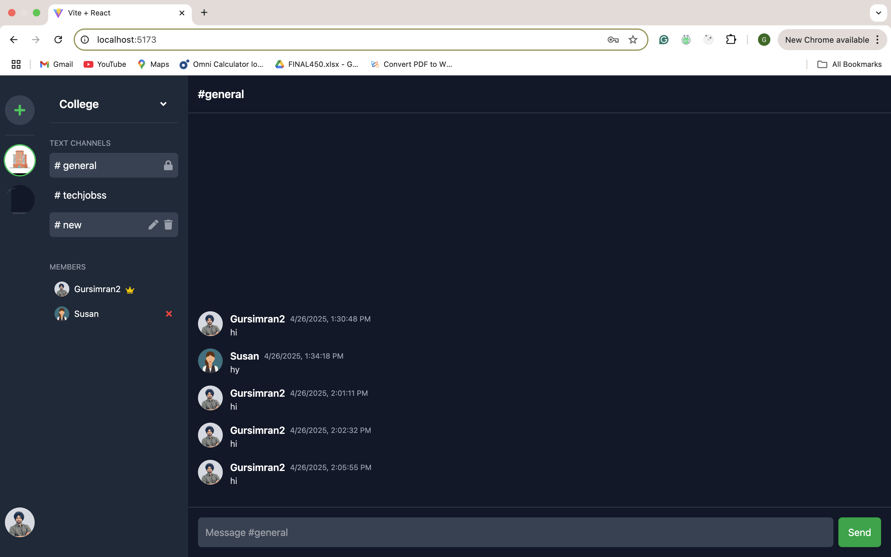

# Linkup – Discord Clone (MERN + Socket.io)

**Linkup** is a real-time chat application inspired by Discord. Built with the MERN stack and Socket.io, it supports user authentication, channel-based messaging, server creation, and live typing indicators.



---

## 🚀 Features

- 🔐 User Login / Registration (JWT-based)
- 🧠 Server Creation with image upload
- 🗂 Channel-based messaging per server
- 🔗 Invite links to join servers
- 💬 Real-time chat via Socket.io
- ✍️ Typing indicator
- 🧭 Server and channel switching
- 💾 MongoDB message persistence

---

## 📦 Tech Stack

**Frontend:**
- React.js (Vite)
- Tailwind CSS
- React Router
- Axios
- Socket.io-client

**Backend:**
- Node.js + Express.js
- MongoDB + Mongoose
- Socket.io
- Multer (for image upload)
- JWT for Auth

---

## 🛠️ Getting Started

### 🔧 Prerequisites
- Node.js & npm
- MongoDB (Atlas or local)

---

### 📁 Project Structure

```bash
Linkup/
├── backend/          # Express server
│   ├── models/       # Mongoose schemas
│   ├── routes/       # Auth & server APIs
│   └── index.js      # Main entry
├── frontend/         # React app
│   ├── src/
│   │   ├── Components/
│   │   ├── App.jsx
│   │   └── ...
└── README.md
🧪 Run Locally
1. Clone the repo
bash
Copy
Edit
git clone https://github.com/YOUR_USERNAME/linkup-discord-clone.git
cd linkup-discord-clone
2. Install backend dependencies
bash
Copy
Edit
cd backend
npm install
Create a .env file in backend:

env
Copy
Edit
MONGO_URI=your_mongodb_connection_string
JWT_SECRET=your_jwt_secret
3. Install frontend dependencies
bash
Copy
Edit
cd ../frontend
npm install
4. Start the app
bash
Copy
Edit
# In one terminal
cd backend
npm run dev

# In another terminal
cd frontend
npm run dev

Server Sidebar	Invite Link Modal
🤝 Contributing
Contributions and feedback are welcome! Feel free to fork, submit issues, or open pull requests.

📄 License
This project is open-source and available under the MIT License.

